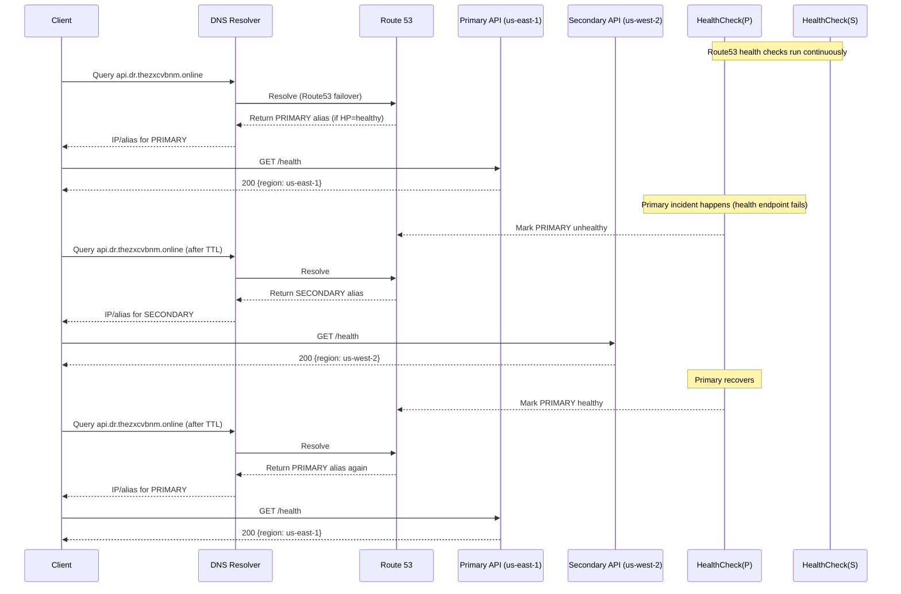

# 🌍 Multi-Region API Gateway Disaster Recovery (Terraform)

## Overview

This project implements a production-style multi-region Disaster Recovery (DR) architecture on AWS using:

- API Gateway (Regional)
- AWS Lambda (Primary + Secondary region)
- Route 53 Failover Routing
- Route 53 Health Checks (HTTPS_STR_MATCH)
- ACM Certificates (DNS validation)
- Custom Domain with Base Path Mapping
- Fully managed via Terraform

---

## 🏗 Architecture

### High-level diagram

```mermaid
graph TD
  U[Client / Browser / curl] --> R53[Route 53: Failover Record<br/>api.dr.thezxcvbnm.online]

  R53 -->|PRIMARY healthy| APIP[API Gateway (Regional)<br/>us-east-1]
  R53 -->|SECONDARY when PRIMARY unhealthy| APIS[API Gateway (Regional)<br/>us-west-2]

  APIP --> LHP[Lambda: health/products/orders<br/>us-east-1]
  APIS --> LHS[Lambda: health/products/orders<br/>us-west-2]

  LHP --> DDB[(DynamoDB Global Table)]
  LHS --> DDB

  subgraph Custom Domain + TLS
    ACM1[ACM cert us-east-1 (DNS validation)] --> APIGWCD1[APIGW Custom Domain (REGIONAL)]
    ACM2[ACM cert us-west-2 (DNS validation)] --> APIGWCD2[APIGW Custom Domain (REGIONAL)]
  end

  R53 -. alias .-> APIGWCD1
  R53 -. alias .-> APIGWCD2

  HC1[Route53 Health Check #1<br/>HTTPS_STR_MATCH /dev/health] --> APIP
  HC2[Route53 Health Check #2<br/>HTTPS_STR_MATCH /dev/health] --> APIS
```

**Key idea:** Route 53 decides which region receives traffic based on health checks.

---

## Key Features

### ✅ Multi-Region Deployment

- Primary: us-east-1
- Secondary: us-west-2
- Separate API Gateway + Lambda per region

### ✅ Custom Domain

- api.dr.thezxcvbnm.online
- ACM certificate with DNS validation
- Base path mapping removes stage from public URL

Public endpoint:

[https://api.dr.thezxcvbnm.online/health](https://api.dr.thezxcvbnm.online/health)

---

## 🔎 Health Checks

Using Route53:

- Type: HTTPS_STR_MATCH
- Path: /dev/health
- Search string: "status": "ok"
- Interval: 10s
- Failure threshold: 3

Important lesson:
Health checks must target the execute-api stage URL,
NOT the regional_domain_name (d-xxxxx endpoint),
because the latter requires a Host header.

---

## 🔁 Failover Behavior

### Sequence diagram (Failover + Failback)



---

## 🧪 Testing Commands

Check active region:

curl [https://api.dr.thezxcvbnm.online/health](https://api.dr.thezxcvbnm.online/health)

Watch live region switching:

watch -n 2 "curl -s [https://api.dr.thezxcvbnm.online/health](https://api.dr.thezxcvbnm.online/health)"

Check DNS resolution:

watch -n 5 "dig +short api.dr.thezxcvbnm.online"

---

## ⚙ Terraform Structure

### Repo layout

```text
.
├── infra
│   ├── bootstrap
│   │   ├── main.tf
│   │   ├── outputs.tf
│   │   ├── providers.tf
│   │   └── variables.tf
│   ├── envs
│   │   ├── dev
│   │   │   ├── backend.tf
│   │   │   ├── main.tf
│   │   │   ├── outputs.tf
│   │   │   ├── providers.tf
│   │   │   └── variables.tf
│   │   └── prod
│   └── modules
│       ├── api_custom_domain
│       ├── apigw
│       ├── dns_api
│       ├── dynamodb
│       ├── iam
│       ├── lambda
│       └── observability
└── lambda
    ├── health
    │   └── lambda_function.py
    ├── orders
    │   └── lambda_function.py
    └── products
        └── index.js
```

---

## 🧩 Terraform snippets (core pieces)

### 1) API Gateway → Lambda proxy integration

```hcl
resource "aws_api_gateway_integration" "health_get_lambda" {
  rest_api_id             = aws_api_gateway_rest_api.api.id
  resource_id             = aws_api_gateway_resource.health_resource.id
  http_method             = aws_api_gateway_method.health_get_method.http_method
  integration_http_method = "POST"                 # always POST for Lambda proxy
  type                    = "AWS_PROXY"

  # API Gateway needs this special "invocations" URI format
  uri = "arn:aws:apigateway:${var.region}:lambda:path/2015-03-31/functions/${var.health_lambda_arn}/invocations"
}
```

### 2) Allow API Gateway to invoke Lambda

```hcl
resource "aws_lambda_permission" "allow_apigw_health" {
  statement_id  = "AllowAPIGatewayInvokeHealth"
  action        = "lambda:InvokeFunction"
  function_name = var.health_lambda_arn
  principal     = "apigateway.amazonaws.com"
  source_arn    = "${aws_api_gateway_rest_api.api.execution_arn}/*/*"
}
```

### 3) Custom domain + base path mapping (remove /dev from public URL)

```hcl
resource "aws_api_gateway_domain_name" "primary" {
  domain_name     = var.domain_name
  certificate_arn = aws_acm_certificate_validation.primary.certificate_arn

  endpoint_configuration {
    types = ["REGIONAL"]
  }
}

resource "aws_api_gateway_base_path_mapping" "primary" {
  domain_name = aws_api_gateway_domain_name.primary.domain_name
  api_id      = var.primary_rest_api_id
  stage_name  = var.primary_stage_name
}
```

### 4) Route 53 failover record (PRIMARY)

```hcl
resource "aws_route53_record" "api_primary" {
  zone_id = var.zone_id
  name    = var.domain_name
  type    = "A"

  set_identifier = "primary"

  failover_routing_policy {
    type = "PRIMARY"
  }

  health_check_id = aws_route53_health_check.primary.id

  alias {
    name                   = aws_api_gateway_domain_name.primary.regional_domain_name
    zone_id                = aws_api_gateway_domain_name.primary.regional_zone_id
    evaluate_target_health = true
  }
}
```

### 5) Route 53 health check (the important part)

```hcl
resource "aws_route53_health_check" "primary" {
  fqdn          = "${var.primary_rest_api_id}.execute-api.${var.primary_region}.amazonaws.com"
  port          = 443
  type          = "HTTPS_STR_MATCH"
  resource_path = "/${var.stage_name}/health"   # e.g. /dev/health

  search_string     = "\"status\": \"ok\""  # match response body
  request_interval  = 10
  failure_threshold = 3
}
```

---

## 🔥 Production Considerations

- Health check string match avoids false positives
- Failure threshold prevents flapping
- Low detection time (~30 seconds)
- Automatic failback supported
- Alias records used for API Gateway

---

## 🚀 Future Enhancements

- CloudWatch alarms for health checks
- SNS notifications
- Latency-based routing instead of pure failover
- WAF protection
- Structured logging + tracing
- CI/CD pipeline

---

## Lessons Learned

1. Do NOT use regional_domain_name for Route53 health checks
2. API Gateway custom domain requires correct Host header
3. HEAD vs GET can cause 403 in health checks
4. HTTPS_STR_MATCH ensures true application health
5. Deployment replacement requires stage handling

---

## Status

✔ Multi-region DR working
✔ Automatic failover + failback verified
✔ Browser + curl validation successful

---

Refinement and production hardening ongoing.
